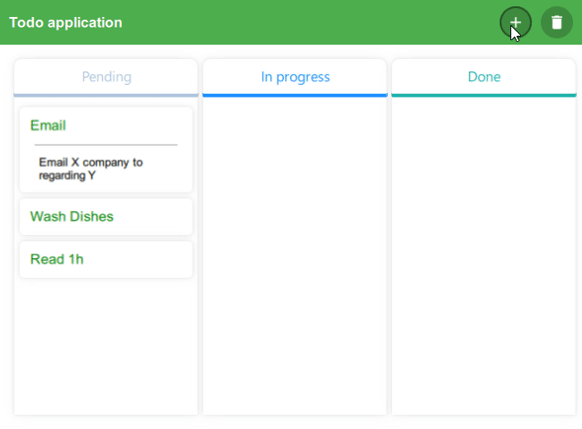
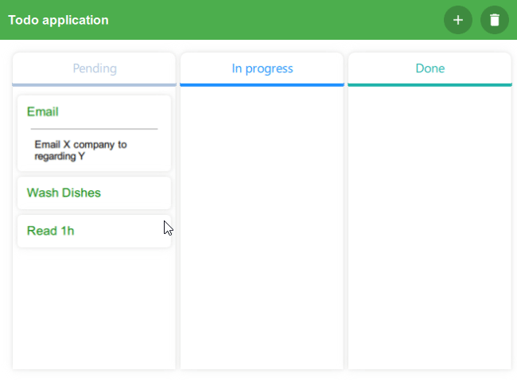
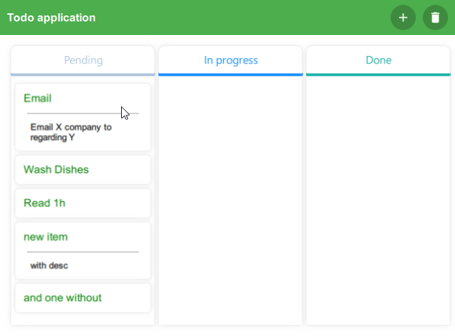
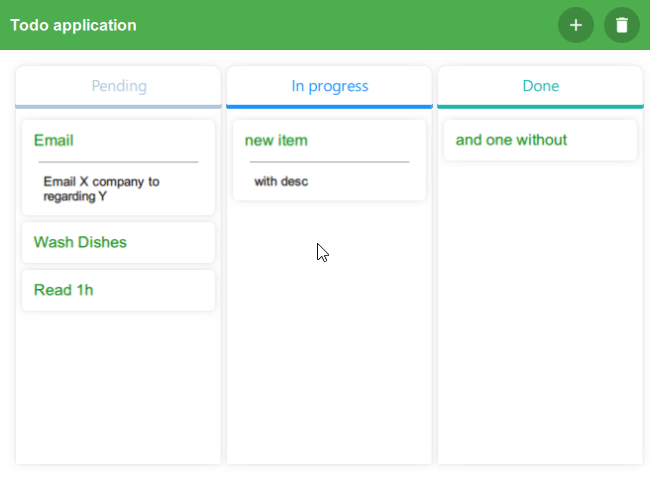

### To do app written in Qt
Ok so this is an app written in Qt where you can add some Todo items. It does save data to files. 
#### Features?
You may ask. It can do several things:
* [add new item with or without description](#adding-item),
* [edit existing item](#editing-item),
* [drag & drop of item between columns](#drag-and-drop),
* [removal of item selected via double click](#items-removal).
  
Thats it. See gifs below to see whow it works. We - people - like to see things in action. 

##### Adding item

***
##### Editing item

***
##### Drag and drop

***
##### Items removal

